## Final Project - Sistem Administrasi Server

Nadila Chusnul K - 1202190020 \
Anastasya Rahma Juniarti - 120219058\
Kelompok 10 

 Login ssh terlebih dahulu 
      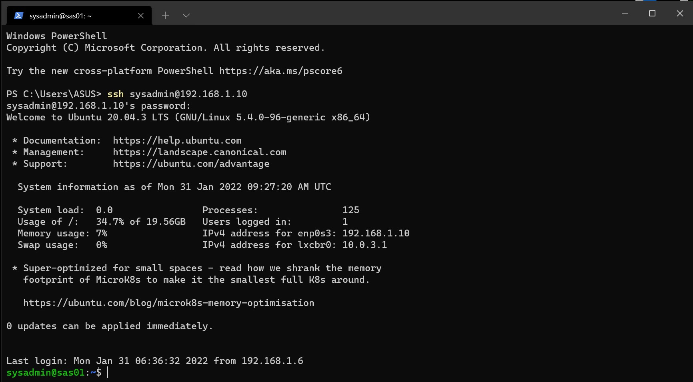

Buat LXC :
## Install LXC php ubuntu 

-  6 LXC ubuntu PHP 7.4
    
```bash
sudo lxc-create -n lxc_php7_1 -t download -- --dist ubuntu --release focal --arch amd64 --force-cache --no-validate --server images.linuxcontainers.org

sudo lxc-create -n lxc_php7_2 -t download -- --dist ubuntu --release focal --arch amd64 --force-cache --no-validate --server images.linuxcontainers.org

sudo lxc-create -n lxc_php7_3 -t download -- --dist ubuntu --release focal --arch amd64 --force-cache --no-validate --server images.linuxcontainers.org

sudo lxc-create -n lxc_php7_4 -t download -- --dist ubuntu --release focal --arch amd64 --force-cache --no-validate --server images.linuxcontainers.org

sudo lxc-create -n lxc_php7_5 -t download -- --dist ubuntu --release focal --arch amd64 --force-cache --no-validate --server images.linuxcontainers.org

sudo lxc-create -n lxc_php7_6 -t download -- --dist ubuntu --release focal --arch amd64 --force-cache --no-validate --server images.linuxcontainers.org
 ```
   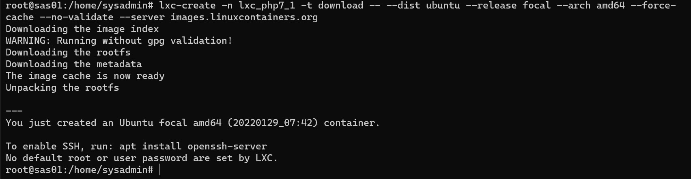
    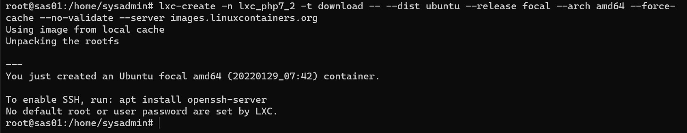
      
        
          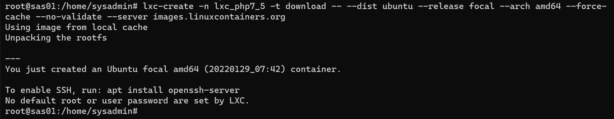
            

## Install LXC php Debian 
- 2 LXC debian PHP 5.6

```bash
sudo lxc-create -n lxc_php5_1 -t download -- --dist debian --release buster --arch amd64 --force-cache --no-validate --server images.linuxcontainers.org

sudo lxc-create -n lxc_php5_2 -t download -- --dist debian --release buster --arch amd64 --force-cache --no-validate --server images.linuxcontainers.org
```
 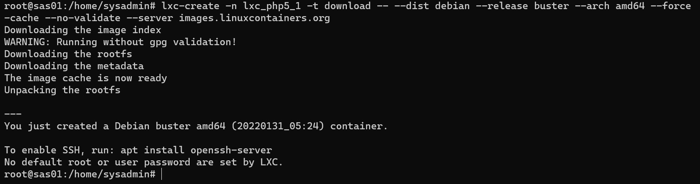
    

## Install LXC php mariadb
- 1 LXC debian mariadb server 

```bash
sudo lxc-create -n lxc_mariadb -t download -- --dist debian --release buster --arch amd64 --force-cache --no-validate --server images.linuxcontainers.org
```
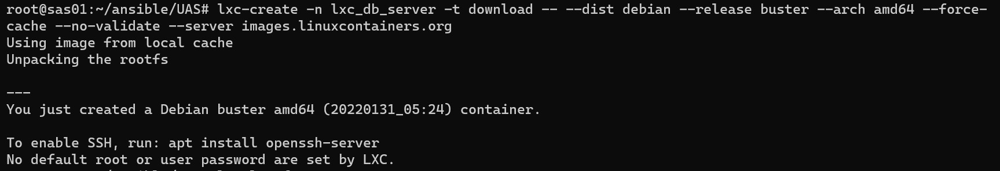

Masuk ansible 
```bash
cd ~/ansible/UAS 
```


Setting autostart, dan IP setiap lxc, ssh
```bash
lxc-ls - f
```
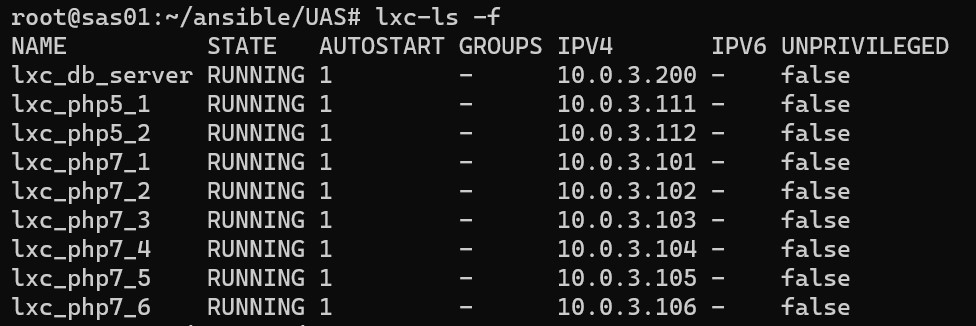

Deploy website menggunakan ansible:

Setting hosts ansible
```bash
nano hosts 
```
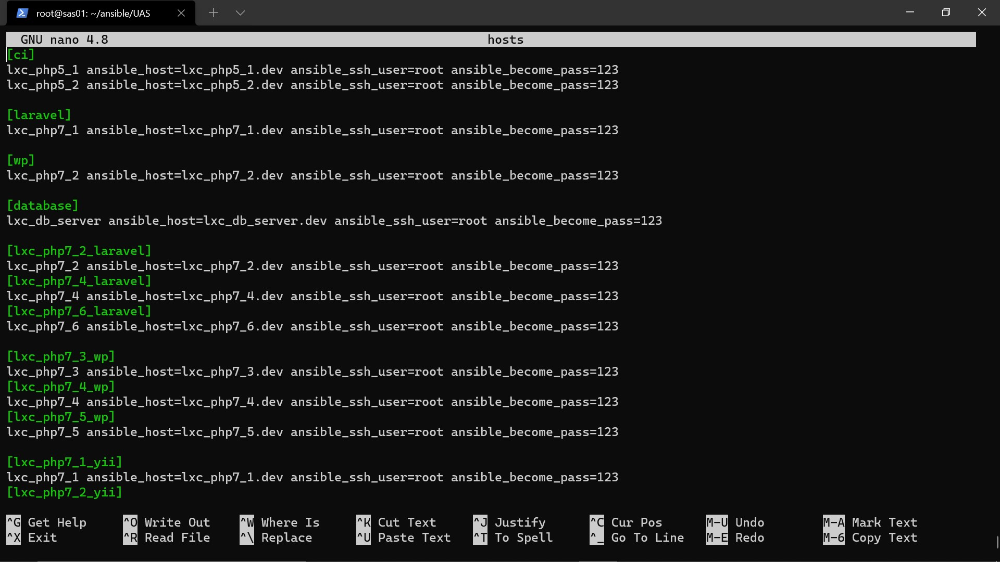
    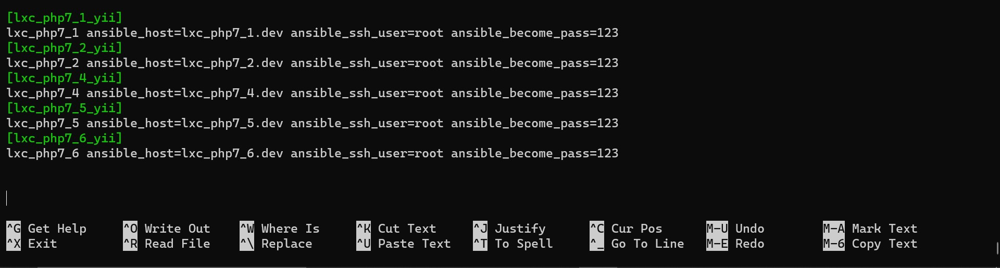

Daftar lxc pada /etc/hosts di vm
```bash
nano / etc/host 
nano hosts 
```
```bash
127.0.0.1 localhost
127.0.1.1 sas01
127.0.0.1 kelompok5.fpsas news.kelompok5.fpsas

#laravel
10.0.3.101  lxc_php7_1.dev
10.0.3.102  lxc_php7_2_laravel.dev
10.0.3.104  lxc_php7_4_laravel.dev
10.0.3.106  lxc_php7_6_laravel.dev

#yii
10.0.3.102  lxc_php7_2_yii.dev
10.0.3.101  lxc_php7_1_yii.dev
10.0.3.104  lxc_php7_4_yii.dev
10.0.3.105  lxc_php7_5_yii.dev
10.0.3.106  lxc_php7_6_yii.dev

#wp
10.0.3.103  lxc_php7_3_wp.dev
10.0.3.102  lxc_php7_2.dev
10.0.3.104  lxc_php7_4_wp.dev
10.0.3.105  lxc_php7_5_wp.dev

#ci
10.0.3.111  lxc_php5_1.dev
10.0.3.112  lxc_php5_2.dev

#db
10.0.3.200  lxc_db_server.dev
#10.0.3.201  lxc_db_server_coba.dev

# The following lines are desirable for IPv6 capable hosts
::1     ip6-localhost ip6-loopback
fe00::0 ip6-localnet
ff00::0 ip6-mcastprefix
ff02::1 ip6-allnodes
ff02::2 ip6-allrouters
```
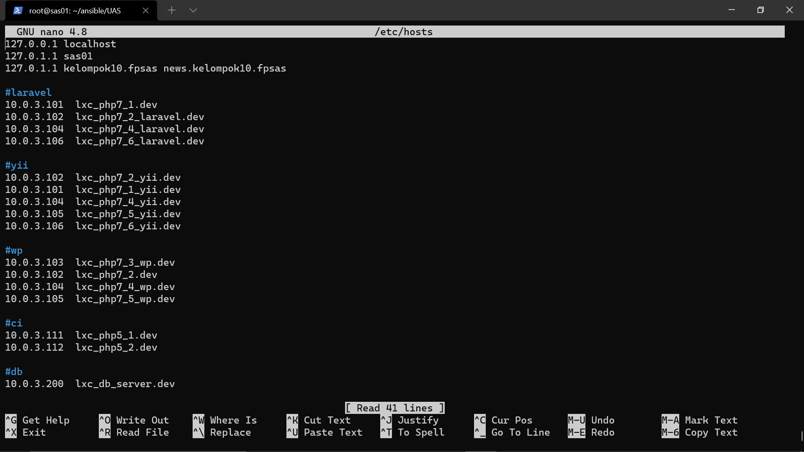
    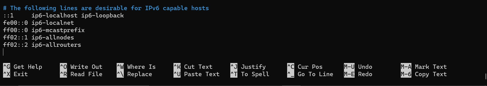

## Setting Ansible Mariadb 
```bash
Nano install-mariadb.yml
```
```bash
- hosts: database
  vars:
    username: 'admin'
    password: '123'
    domain: 'lxc_db_server.dev'
  roles:
    - db
    - pma
```

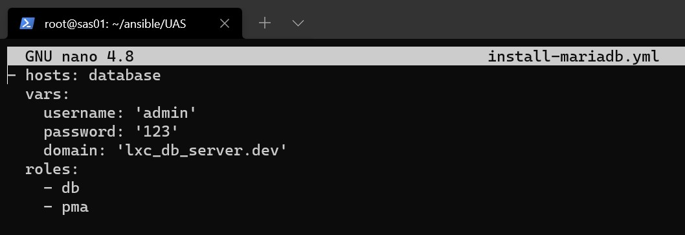

```bash
mkdir roles 
mkdir roles/db
mkdir roles/db/handlers
```

## Roles db 

```bash
nano roles/db/handlers/main.yml 
```

```bash
---
- name: restart mysql
  become: yes
  become_user: root
  become_method: su
  action: service name=mysql state=restarted 
```
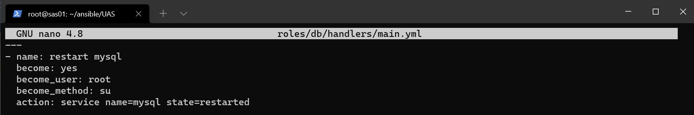

```bash
mkdir roles/db/tasks
nano roles/db/tasks/main.yml
```

```bash
---
- name: delete apt chache
  become: yes
  become_user: root
  become_method: su
  command: rm -vf /var/lib/apt/lists/*

- name: install mariadb
  become: yes
  become_user: root
  become_method: su
  apt: name={{ item }} state=latest update_cache=true
  with_items:
   - python
   - mariadb-server
   - mariadb-client
   - python-mysqldb
   - python-pymysql

- name: Stop MySQL
  service: name=mysqld state=stopped

- name: set environment variables
  shell: systemctl set-environment MYSQLD_OPTS="--skip-grant-tables"

- name: Start MySQL
  service: name=mysqld state=started

- name: sql query
  command:  mysql -u root --execute="UPDATE mysql.user SET authentication_string = PASSWORD('{{ password }}') WHERE User = 'root' AND Host = 'localhost';"

- name: sql query flush
  command:  mysql -u root --execute="FLUSH PRIVILEGES"

- name: Stop MySQL
  service: name=mysqld state=stopped

- name: unset environment variables
  shell: systemctl unset-environment MYSQLD_OPTS

- name: Start MySQL
  service: name=mysqld state=started

- name: Create user for mysql
  command:  mysql -u root --execute="CREATE USER IF NOT EXISTS '{{ username }}'@'localhost' IDENTIFIED BY '{{ password }}';"

- name: GRANT ALL PRIVILEGES to user {{username}}
  command:  mysql -u root --execute="GRANT ALL PRIVILEGES ON * . * TO '{{ username }}'@'localhost';"

- name: Create user for remote mysql
  command:  mysql -u root --execute="CREATE USER IF NOT EXISTS '{{ username }}'@'%' IDENTIFIED BY '{{ password }}';"

- name: GRANT ALL PRIVILEGES to remote user {{username}}
  command:  mysql -u root --execute="GRANT ALL PRIVILEGES ON * . * TO '{{ username }}'@'%';"

- name: sql query flush
  command:  mysql -u root --execute="FLUSH PRIVILEGES"

- name: Create DB Landing
  command:  mysql -u root --execute="CREATE DATABASE IF NOT EXISTS `landing`;"

- name: Create DB product
  command:  mysql -u root --execute="CREATE DATABASE IF NOT EXISTS `product`;"

- name: Create DB app
  command:  mysql -u root --execute="CREATE DATABASE IF NOT EXISTS `app`;"

- name: Create DB news
  command:  mysql -u root --execute="CREATE DATABASE IF NOT EXISTS `news`;"

- name: Copy .my.cnf file with root password credentials
  template:
    src=templates/my.cnf
    dest=/etc/mysql/mariadb.conf.d/50-server.cnf
  notify: restart mysql
```

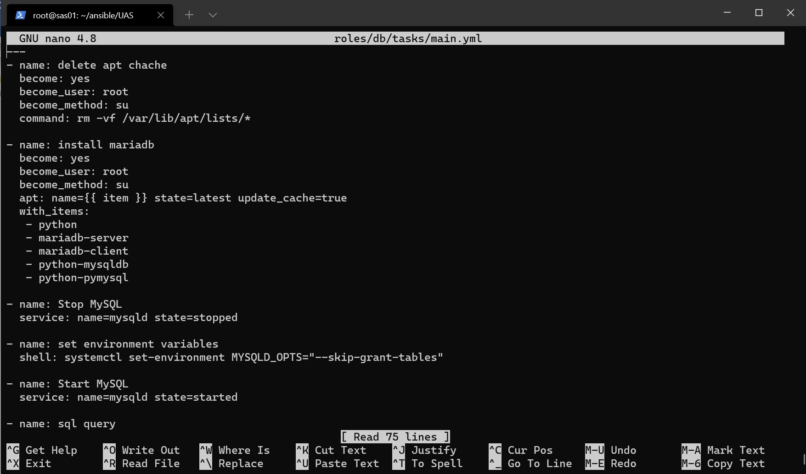

```bash
mkdir roles/db/templates
nano roles/db/templates/my.cnf
```
```bash
#
# These groups are read by MariaDB server.
# Use it for options that only the server (but not clients) should see
#
# See the examples of server my.cnf files in /usr/share/mysql

# this is read by the standalone daemon and embedded servers
[server]

# this is only for the mysqld standalone daemon
[mysqld]

#
# * Basic Settings
#
user                    = mysql
pid-file                = /run/mysqld/mysqld.pid
socket                  = /run/mysqld/mysqld.sock
port                   = 3306
basedir                 = /usr
datadir                 = /var/lib/mysql
tmpdir                  = /tmp
lc-messages-dir         = /usr/share/mysql
skip-external-locking

# Instead of skip-networking the default is now to listen only on
# localhost which is more compatible and is not less secure.
bind-address            = 0.0.0.0

#
# * Fine Tuning
#
key_buffer_size        = 16M
max_allowed_packet     = 16M
thread_stack           = 192K
thread_cache_size      = 8
# This replaces the startup script and checks MyISAM tables if needed
# the first time they are touched
myisam_recover_options = BACKUP
#max_connections        = 100
#table_cache            = 64
#thread_concurrency     = 10

#
# * Query Cache Configuration
#
query_cache_limit      = 1M
query_cache_size        = 16M

#
# * Logging and Replication
#
# Both location gets rotated by the cronjob.
# Be aware that this log type is a performance killer.
# As of 5.1 you can enable the log at runtime!
#general_log_file       = /var/log/mysql/mysql.log
#general_log            = 1
#
# Error log - should be very few entries.
#
log_error = /var/log/mysql/error.log
#
# Enable the slow query log to see queries with especially long duration
#slow_query_log_file    = /var/log/mysql/mariadb-slow.log
#long_query_time        = 10
#log_slow_rate_limit    = 1000
#log_slow_verbosity     = query_plan
#log-queries-not-using-indexes
#
# The following can be used as easy to replay backup logs or for replication.
# note: if you are setting up a replication slave, see README.Debian about
#       other settings you may need to change.
#server-id              = 1
#log_bin                = /var/log/mysql/mysql-bin.log
expire_logs_days        = 10
max_binlog_size        = 100M
#binlog_do_db           = include_database_name
#binlog_ignore_db       = exclude_database_name

#
# * Security Features
#
# Read the manual, too, if you want chroot!
#chroot = /var/lib/mysql/
#
# For generating SSL certificates you can use for example the GUI tool "tinyca".
#
#ssl-ca = /etc/mysql/cacert.pem
#ssl-cert = /etc/mysql/server-cert.pem
#ssl-key = /etc/mysql/server-key.pem
#
# Accept only connections using the latest and most secure TLS protocol version.
# ..when MariaDB is compiled with OpenSSL:
#ssl-cipher = TLSv1.2
# ..when MariaDB is compiled with YaSSL (default in Debian):
#ssl = on

#
# * Character sets
#
# MySQL/MariaDB default is Latin1, but in Debian we rather default to the full
# utf8 4-byte character set. See also client.cnf
#
character-set-server  = utf8mb4
collation-server      = utf8mb4_general_ci

#
# * InnoDB
#
# InnoDB is enabled by default with a 10MB datafile in /var/lib/mysql/.
# Read the manual for more InnoDB related options. There are many!

#
# * Unix socket authentication plugin is built-in since 10.0.22-6
#
# Needed so the root database user can authenticate without a password but
# only when running as the unix root user.
#
# Also available for other users if required.
# See https://mariadb.com/kb/en/unix_socket-authentication-plugin/

# this is only for embedded server
[embedded]

# This group is only read by MariaDB servers, not by MySQL.
# If you use the same .cnf file for MySQL and MariaDB,
# you can put MariaDB-only options here
[mariadb]

# This group is only read by MariaDB-10.3 servers.
# If you use the same .cnf file for MariaDB of different versions,
# use this group for options that older servers don't understand
[mariadb-10.3]
```

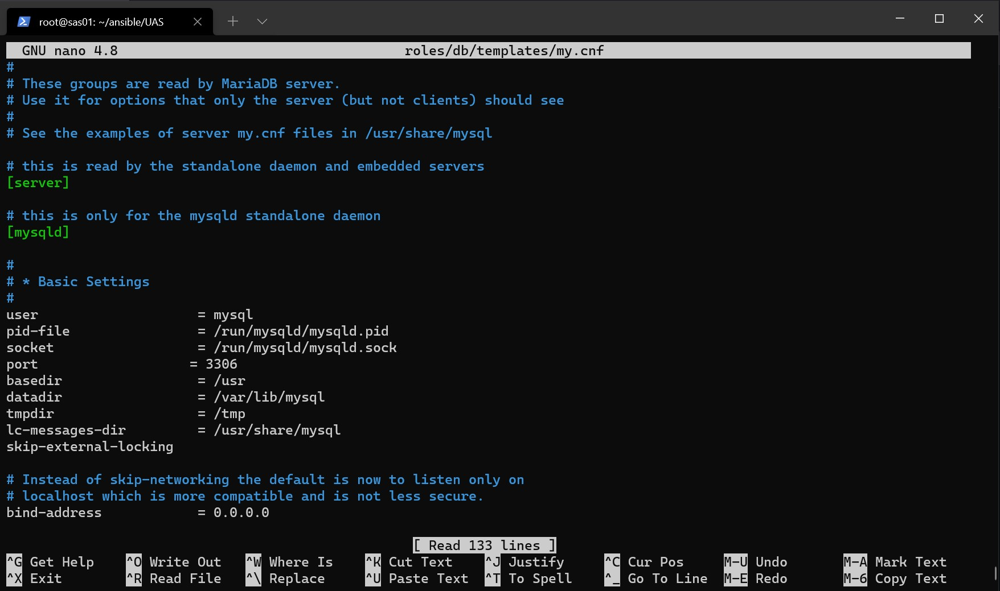

```bash
mkdir roles/pma
mkdir roles/pma/handlers
nano roles/pma/handlers/main.yml 
```
```bash
---
 - name: stop apache2
   become: yes
   become_user: root
   become_method: su
   action: service name=apache2 state=stopped

 - name: restart nginx
   become: yes
   become_user: root
   become_method: su
   action: service name=nginx state=restarted

 - name: restart php
   become: yes
   become_user: root
   become_method: su
   action: service name=php7.2-fpm state=restarted
```
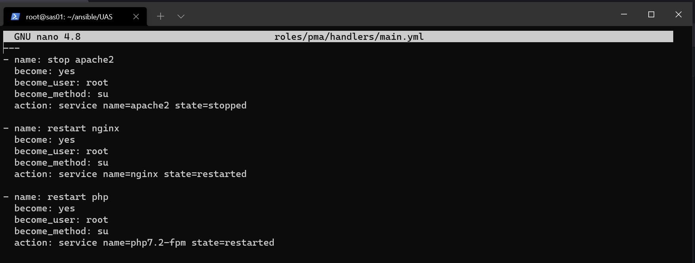

```bash
mkdir roles/pma/tasks
nano roles/pma /tasks/main.yml 
```

```bash
---
- name: delete apt chache
  become: yes
  become_user: root
  become_method: su
  command: rm -vf /var/lib/apt/lists/*

- name: install nginx phpmyadmin
  become: yes
  become_user: root
  become_method: su
  apt: name={{ item }} state=latest update_cache=true
  with_items:
    - curl
    - nginx
    - nginx-extras
    - php7.3-fpm
    - php-mbstring
    - php-zip
    - php-gd
    - php-json
    - php-curl
    - wget
    - php7.3-xml
    - php7.3-mysqli

- name: wget phpmyadmin
  shell: wget https://files.phpmyadmin.net/phpMyAdmin/5.1.1/phpMyAdmin-5.1.1-all-languages.tar.gz

- name: tar latest.tar.gz
  shell: tar -zxvf phpMyAdmin-5.1.1-all-languages.tar.gz

- name: move phpmyadmin
  shell: sudo mv phpMyAdmin-5.1.1-all-languages /usr/share/phpmyadmin

- name: Create a tmp directory for phpMyAdmin and then change the permission.
  command: mkdir /usr/share/phpmyadmin/tmp

- name: change permission storage
  command: chmod 777 /usr/share/phpmyadmin/tmp

- name: Set the ownership of the phpMyAdmin directory.
  command: chown -R www-data:www-data /usr/share/phpmyadmin

- name: copy config
  template:
    src=templates/conf.inc.php
    dest=/usr/share/phpmyadmin/config.inc.php

- name: enable module php mbstring
  command: phpenmod mbstring
  notify:
    - restart php

- name: Copy pma.local
  template:
    src=templates/pma.local
    dest=/etc/nginx/sites-available/{{ domain }}
  vars:
    servername: '{{ domain }}'

- name: Symlink pma.local
  command: ln -sfn /etc/nginx/sites-available/{{ domain }} /etc/nginx/sites-enabled/{{ domain }}
  notify:
    - stop apache2
    - restart nginx

- name: Write {{ domain }} to /etc/hosts
  lineinfile:
    dest: /etc/hosts
    regexp: '.*{{ domain }}$'
    line: "127.0.0.1 {{ domain }}"
    state: present
```
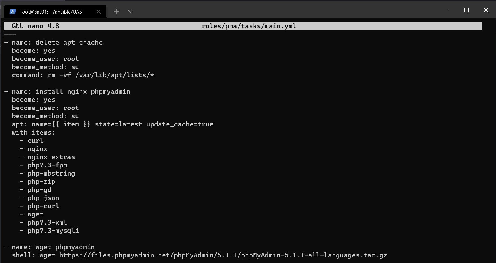

```bash
mkdir roles/pma/templates
nano roles/pma/templates/conf.inc.php 
```

```bash
<?php
/**
 * phpMyAdmin sample configuration, you can use it as base for
 * manual configuration. For easier setup you can use setup/
 *
 * All directives are explained in documentation in the doc/ folder
 * or at <https://docs.phpmyadmin.net/>.
 */

declare(strict_types=1);

/**
 * This is needed for cookie based authentication to encrypt password in
 * cookie. Needs to be 32 chars long.
 */
$cfg['blowfish_secret'] = 'KELOMPOK5SISTEMADMINISTRASISERVE'; /* YOU MUST FILL IN THIS FOR COOKIE AUTH! */

/**
 * Servers configuration
 */
$i = 0;

/**
 * First server
 */
$i++;
/* Authentication type */
$cfg['Servers'][$i]['auth_type'] = 'cookie';
/* Server parameters */
$cfg['Servers'][$i]['host'] = 'localhost';
$cfg['Servers'][$i]['compress'] = false;
$cfg['Servers'][$i]['AllowNoPassword'] = false;

/**
 * phpMyAdmin configuration storage settings.
 */

/* User used to manipulate with storage */
$cfg['Servers'][$i]['controlhost'] = 'localhost';
$cfg['Servers'][$i]['controlport'] = '3306';
$cfg['Servers'][$i]['controluser'] = '{{username}}';
$cfg['Servers'][$i]['controlpass'] = '{{password}}';

/* Storage database and tables */
$cfg['Servers'][$i]['pmadb'] = 'phpmyadmin';
$cfg['Servers'][$i]['bookmarktable'] = 'pma__bookmark';
$cfg['Servers'][$i]['relation'] = 'pma__relation';
$cfg['Servers'][$i]['table_info'] = 'pma__table_info';
$cfg['Servers'][$i]['table_coords'] = 'pma__table_coords';
$cfg['Servers'][$i]['pdf_pages'] = 'pma__pdf_pages';
$cfg['Servers'][$i]['column_info'] = 'pma__column_info';
$cfg['Servers'][$i]['history'] = 'pma__history';
$cfg['Servers'][$i]['table_uiprefs'] = 'pma__table_uiprefs';
$cfg['Servers'][$i]['tracking'] = 'pma__tracking';
$cfg['Servers'][$i]['userconfig'] = 'pma__userconfig';
$cfg['Servers'][$i]['recent'] = 'pma__recent';
$cfg['Servers'][$i]['favorite'] = 'pma__favorite';
$cfg['Servers'][$i]['users'] = 'pma__users';
$cfg['Servers'][$i]['usergroups'] = 'pma__usergroups';
$cfg['Servers'][$i]['navigationhiding'] = 'pma__navigationhiding';
$cfg['Servers'][$i]['savedsearches'] = 'pma__savedsearches';
$cfg['Servers'][$i]['central_columns'] = 'pma__central_columns';
$cfg['Servers'][$i]['designer_settings'] = 'pma__designer_settings';
$cfg['Servers'][$i]['export_templates'] = 'pma__export_templates';

/**
 * End of servers configuration
 */

/**
 * Directories for saving/loading files from server
 */
$cfg['UploadDir'] = '';
$cfg['SaveDir'] = '';

/**
 * Whether to display icons or text or both icons and text in table row
 * action segment. Value can be either of 'icons', 'text' or 'both'.
 * default = 'both'
 */
//$cfg['RowActionType'] = 'icons';

/**
 * Defines whether a user should be displayed a "show all (records)"
 * button in browse mode or not.
 * default = false
 */
//$cfg['ShowAll'] = true;

/**
 * Number of rows displayed when browsing a result set. If the result
 * set contains more rows, "Previous" and "Next".
 * Possible values: 25, 50, 100, 250, 500
 * default = 25
 */
//$cfg['MaxRows'] = 50;

/**
 * Disallow editing of binary fields
 * valid values are:
 *   false    allow editing
 *   'blob'   allow editing except for BLOB fields
 *   'noblob' disallow editing except for BLOB fields
 *   'all'    disallow editing
 * default = 'blob'
 */
//$cfg['ProtectBinary'] = false;

/**
 * Default language to use, if not browser-defined or user-defined
 * (you find all languages in the locale folder)
 * uncomment the desired line:
 * default = 'en'
 */
//$cfg['DefaultLang'] = 'en';
//$cfg['DefaultLang'] = 'de';

/**
 * How many columns should be used for table display of a database?
 * (a value larger than 1 results in some information being hidden)
 * default = 1
 */
//$cfg['PropertiesNumColumns'] = 2;

/**
 * Set to true if you want DB-based query history.If false, this utilizes
 * JS-routines to display query history (lost by window close)
 *
 * This requires configuration storage enabled, see above.
 * default = false
 */
//$cfg['QueryHistoryDB'] = true;

/**
 * When using DB-based query history, how many entries should be kept?
 * default = 25
 */
//$cfg['QueryHistoryMax'] = 100;

/**
 * Whether or not to query the user before sending the error report to
 * the phpMyAdmin team when a JavaScript error occurs
 *
 * Available options
 * ('ask' | 'always' | 'never')
 * default = 'ask'
 */
//$cfg['SendErrorReports'] = 'always';

/**
 * You can find more configuration options in the documentation
 * in the doc/ folder or at <https://docs.phpmyadmin.net/>.
 */
```

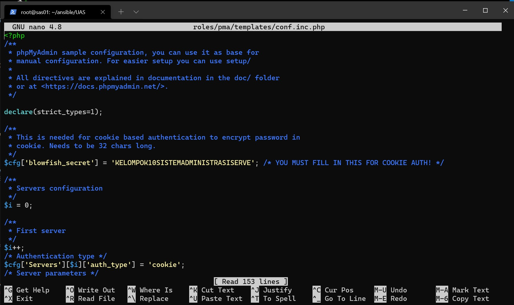

```bash
nano roles/pma/templates/pma.local 
```

```bash
server {
    listen 80;

    server_name {{servername}};

    root /usr/share/phpmyadmin;

    index index.php;

    location / {

         try_files $uri $uri/ @phpmyadmin;

    }

    location @phpmyadmin {
            fastcgi_pass unix:/run/php/php7.3-fpm.sock;   #Sesuaikan dengan versi PHP
            fastcgi_param SCRIPT_FILENAME /usr/share/phpmyadmin/index.php;
            include /etc/nginx/fastcgi_params;
            fastcgi_param SCRIPT_NAME /index.php;

    }

    location ~ \.php$ {

            fastcgi_pass unix:/run/php/php7.3-fpm.sock;  #Sesuaikan dengan versi PHP
            fastcgi_index index.php;
            fastcgi_param SCRIPT_FILENAME /usr/share/phpmyadmin$fastcgi_script_name;
            include fastcgi_params;

    }
}
```
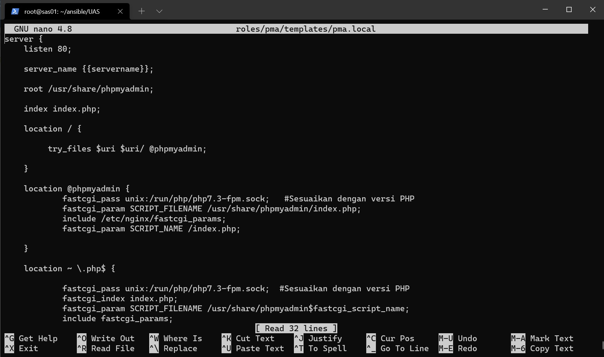

Run ansible install-mariadb.yml
```bash
ansible-playbook -i hosts install-mariadb.yml -k 
```
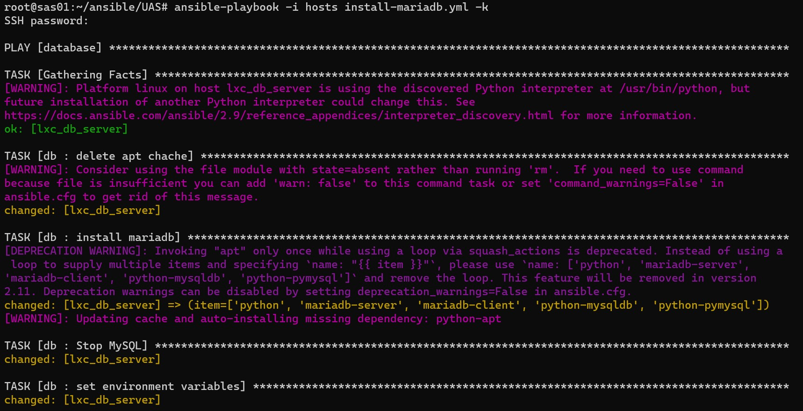

hasilnya seperti ini:
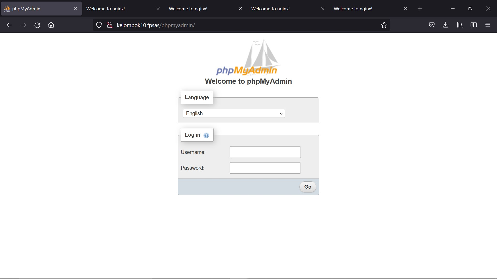
    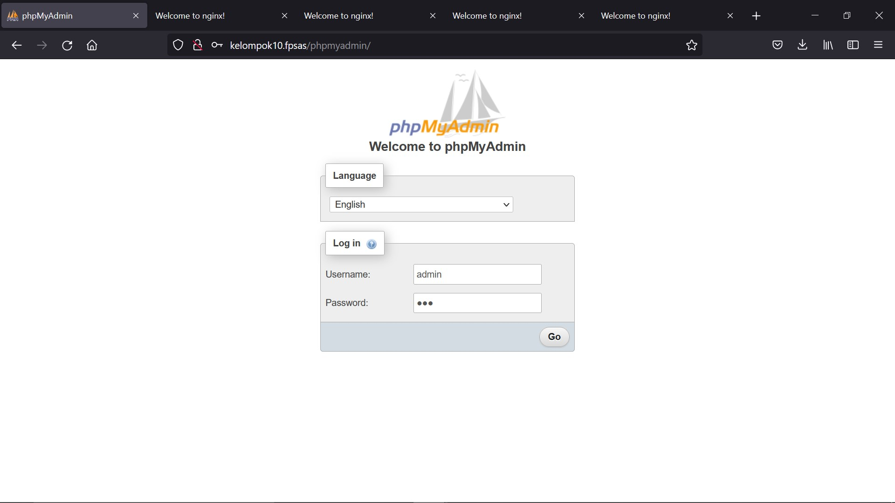
         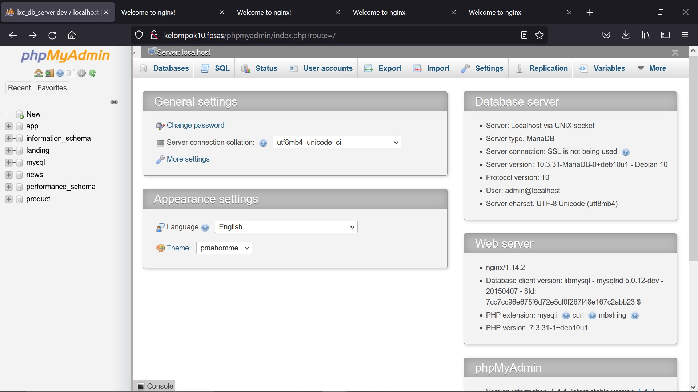
